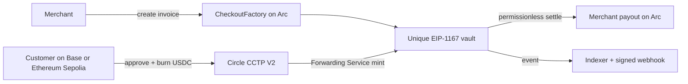

# Arc Crosschain Checkout

Accept USDC from multiple chains through one payment link and settle every invoice on Arc.

Merchants should not need to integrate separate bridges, destination gas flows, and reconciliation logic just because customers hold USDC on different chains. Arc Crosschain Checkout creates one deterministic vault per invoice on Arc, uses Circle CCTP V2 to route native USDC from Base Sepolia or Ethereum Sepolia, and finalizes merchant payout with a permissionless onchain settlement.

> Status: complete local/testnet-ready MVP. Arc Testnet deployment and real transaction evidence are pending deployer credentials and funded testnet wallets. The contracts have not been audited.

## How it works



Arc is not a network-selector add-on: the invoice vault, final settlement event, fee distribution, merchant payout, refund path, and source of truth all live on Arc. Arc uses USDC for gas and offers deterministic sub-second finality.

## Supported routes

| Source           | CCTP domain | Destination | CCTP domain | Mode                      |
| ---------------- | ----------: | ----------- | ----------: | ------------------------- |
| Base Sepolia     |           6 | Arc Testnet |          26 | CCTP V2 Fast + Forwarding |
| Ethereum Sepolia |           0 | Arc Testnet |          26 | CCTP V2 Fast + Forwarding |

Solana Devnet is documented as a later extension and is intentionally not in the MVP UI.

## Project-owned contracts

- `MerchantRegistry`: self-service merchant registration and payout settings.
- `FeeManager`: bounded protocol fee and treasury for new invoices.
- `CheckoutFactory`: deterministic CREATE2 minimal-proxy invoice deployment.
- `PaymentVault`: invoice funding, settlement, timeout refund, and excess handling.

USDC, TokenMessengerV2, MessageTransmitterV2, TokenMinterV2, Circle CCTP, and the Forwarding Service are shared Circle infrastructure and are not authored or deployed by this project.

## Repository

```text
apps/web       Next.js merchant and customer experience
apps/api       validated REST API and signed-webhook management
apps/worker    CCTP tracking, Arc reconciliation, settlement and retries
packages/contracts      Foundry contracts and tests
packages/chain-config   validated network source of truth
packages/cctp           fee quoting and message tracking
packages/database       Prisma/PostgreSQL schema
packages/checkout-sdk   typed merchant SDK
packages/shared         schemas and six-decimal amount utilities
packages/ui             reusable UI surface
docs                    architecture, deployment and submission package
```

## Local demo

Requirements: Node 22.13+, pnpm 11, Docker, and Foundry for contract tests.

```bash
cp .env.example .env
pnpm install
pnpm demo:up
pnpm db:generate
pnpm db:migrate
pnpm seed
pnpm dev
```

Open `http://localhost:3000`, then use the seeded link `/pay/demo-1042`. Demo mode is visibly labeled and never presents mock hashes as real transactions. See [the runbook](docs/DEMO_RUNBOOK.md).

## Tests and verification

```bash
pnpm format:check
pnpm lint
pnpm typecheck
pnpm test
pnpm test:contracts
pnpm --filter @arc-checkout/contracts coverage
pnpm build
pnpm security:scan
```

Coverage is generated in CI; no percentage is claimed until the command has run in the target environment.

## Deployment

Import a deployer into Foundry's encrypted keystore, fund it with Arc Testnet USDC, set the non-secret RPC configuration, and run `pnpm deploy:contracts`. Never pass or commit a plaintext key. Deployment records remain explicitly `pending-credentials` in `deployments/arc-testnet.json` until real receipts exist. See [deployment instructions](docs/DEPLOYMENT.md).

## Circle integrations

- Native Circle-issued USDC (6-decimal ERC-20 accounting)
- CCTP V2 Fast Transfer
- Circle Forwarding Service
- Circle Iris fee and message APIs
- Circle App Kit with the Viem browser-wallet adapter

## Security model and limitations

The database is an index; Arc contract state wins. Existing vault settlement and refunds cannot be paused. Fees and payout addresses are snapshotted at invoice creation. Webhooks use encrypted-at-rest secrets, raw-body HMAC SHA-256 signatures, replay-resistant timestamps, and bounded retries.

This is testnet software, is not audited, and does not provide automatic crosschain refunds. Before a burn, the customer signs an EIP-712 payment attempt that permanently locks the payer and customer-controlled Arc refund address; the merchant cannot select or replace it. Merchant mutations use short-lived wallet-signature sessions or hashed, scoped and revocable server API keys. App Kit recovery resumes a persisted successful burn, while the worker independently validates both chain receipts and the raw CCTP message. Production-grade RPC redundancy, external monitoring, and a professional contract audit remain required. Read [SECURITY.md](SECURITY.md) and [known limitations](docs/KNOWN_LIMITATIONS.md).

## Links

- Live demo: pending deployment credentials
- Demo video: pending real testnet transaction recording
- [Architecture](docs/ARCHITECTURE.md)
- [Hackathon submission](docs/HACKATHON_SUBMISSION.md)
- [Three-minute video script](docs/VIDEO_SCRIPT.md)
