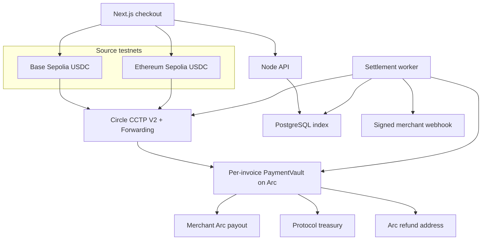
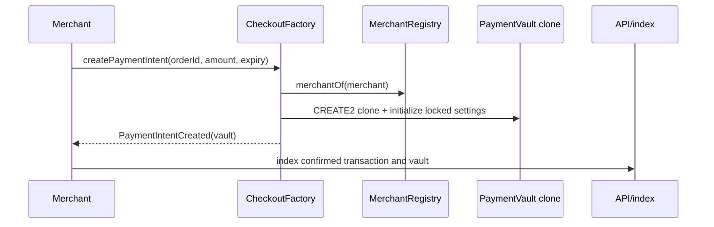
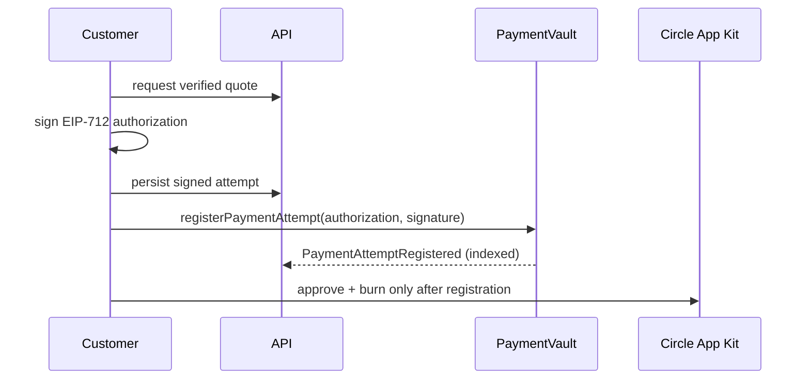
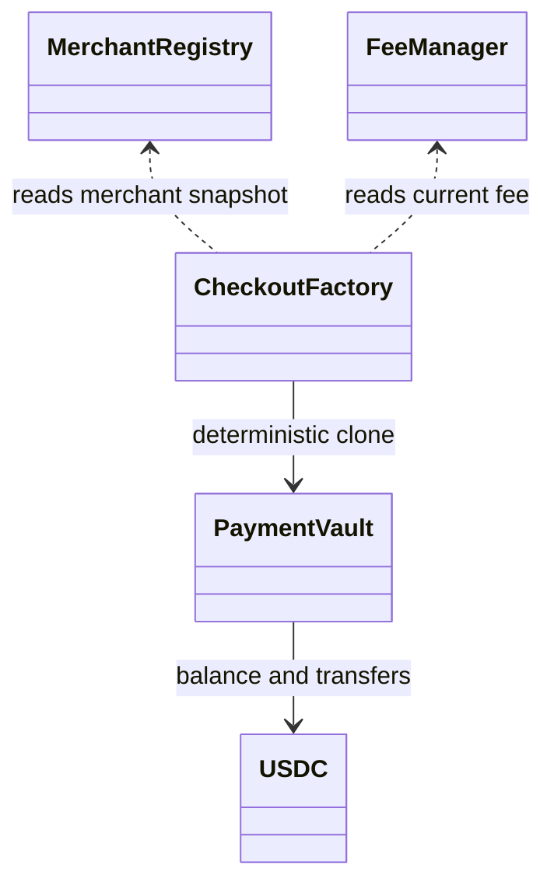

# Architecture

## System

The factory event and vault state are authoritative. PostgreSQL accelerates queries and records attempts, delivery state, and index cursors but cannot override Arc.

## Invoice creation

## Customer-owned payment attempt

The first valid attempt permanently locks the customer and Arc refund address. Expired attempts can be replaced only by the same customer/refund pair. A merchant cannot supply or redirect the refund recipient.

## Contract relationships

## Operational boundaries

- The browser signs merchant Arc transactions and customer source-chain CCTP transactions.
- The worker may sign only permissionless `settle()` calls; it never holds customer funds.
- Forwarding removes destination-mint signer and gas requirements.
- Webhook delivery begins only after onchain-derived state changes.
