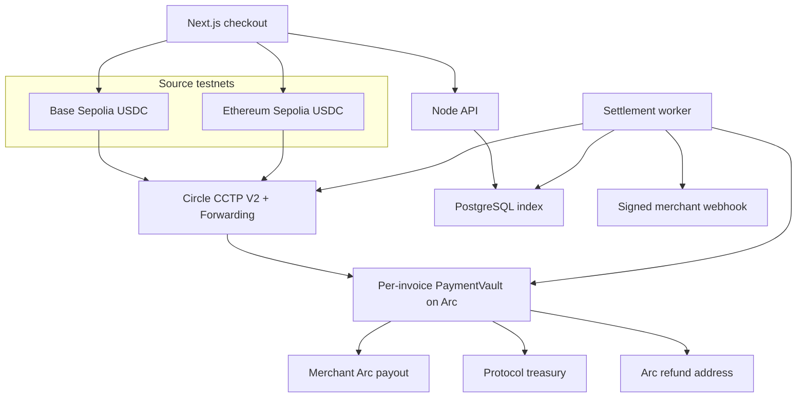
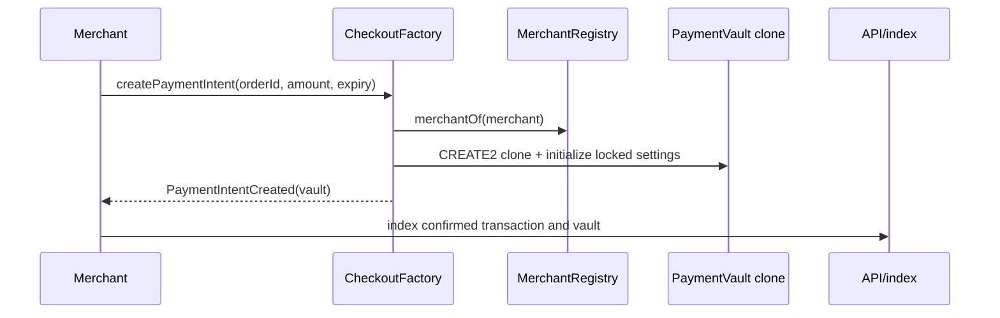
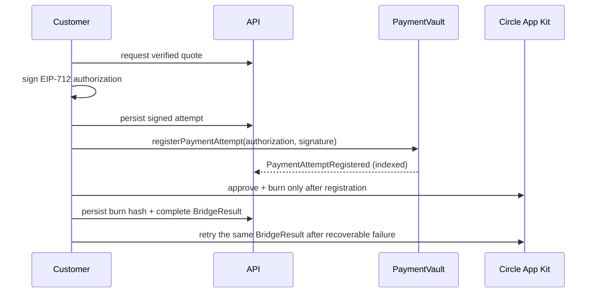
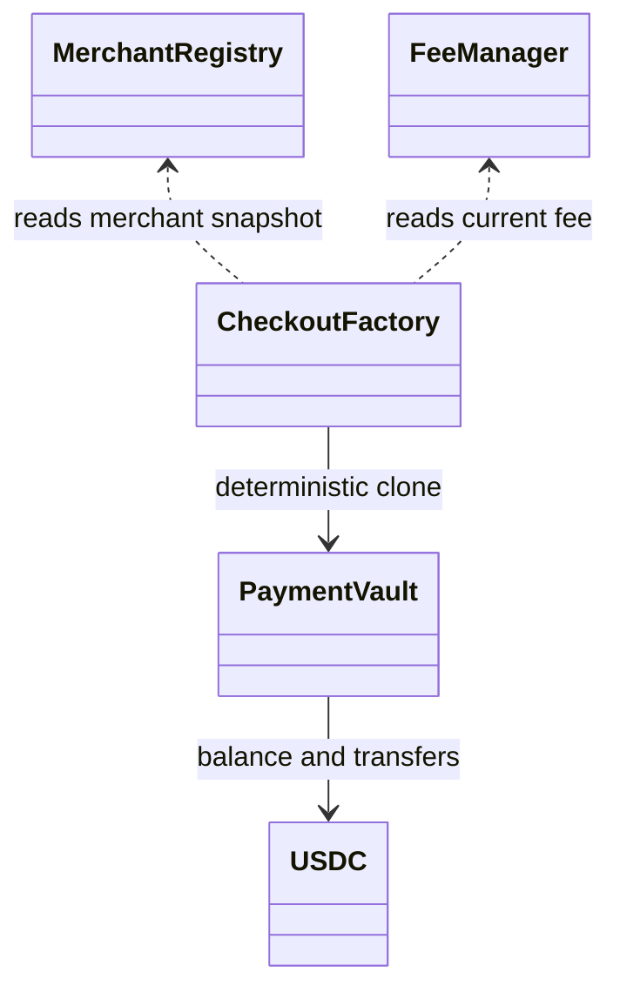

# Architecture

## System

The factory event and vault state are authoritative. PostgreSQL accelerates queries and records attempts, delivery state, and index cursors but cannot override Arc.

## Invoice creation

## Customer-owned payment attempt

The first onchain-valid attempt permanently locks the customer and Arc refund address. Expired registered attempts can be replaced only by that same customer/refund pair. An expired quote that was never registered may be discarded safely. A merchant cannot supply or redirect the refund recipient.

## Contract relationships

## Operational boundaries

- The browser signs merchant Arc transactions and customer source-chain CCTP transactions.
- The worker may sign only permissionless `settle()` calls; it never holds customer funds.
- Forwarding removes destination-mint signer and gas requirements.
- The worker treats source receipts, raw CCTP messages, and Arc USDC logs as the settlement evidence; an Iris `forwardTxHash` alone is insufficient.
- Webhook delivery begins only after onchain-derived state changes.

## Transactional webhook outbox

Every payment lifecycle mutation and its immutable webhook event are written in the same database transaction. Arc event IDs include chain ID, transaction hash, and log index; offchain lifecycle IDs use the attempt, source transaction, CCTP message, or Arc mint identity. Endpoint deliveries reference that one event, use atomic `SKIP LOCKED` claims, recover stale claims, preserve attempt history, and enforce event sequence per invoice and endpoint. Replays and resends reuse the original event ID.

## Finalized indexing and settlement recovery

The Arc indexer reads only the RPC `finalized` block, processes a bounded page in log order, and advances its durable cursor only after every log in that page succeeds. Replayed pages and duplicate logs are harmless because chain ID, transaction hash, and log index form the database identity. Cursor health records the observed head, finalized block, processed block, last success, and last error.

Automatic settlement uses an atomic PostgreSQL claim plus a unique lock token. The worker signs the exact permissionless `settle()` transaction, persists its raw signed transaction and deterministic hash before broadcast, then broadcasts that same payload. A crash before or after broadcast therefore resumes one transaction instead of creating a second nonce. Submission history preserves confirmed, reverted, failed, and stale-recovered attempts; only the finalized `PaymentSettled` event establishes accounting.
