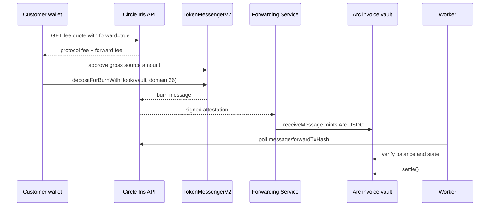

# CCTP V2 flow

The source burn amount is grossed up so the requested invoice amount reaches the vault. The quote uses the current `minimumFee` and median `forwardFee`, adds a bounded safety buffer, expires after one minute, and is never hardcoded. Any destination excess is deterministically returned to the locked Arc refund address.

Official testnet domains: Ethereum 0, Base 6, Arc 26. TokenMessengerV2 is `0x8FE6B999Dc680CcFDD5Bf7EB0974218be2542DAA`; MessageTransmitterV2 is `0xE737e5cEBEEBa77EFE34D4aa090756590b1CE275`. Values were verified against official Circle and Arc documentation on 2026-07-20 and live in one validated package.

Forwarding hook data uses Circle's reserved `cctp-forward` bytes. `destinationCaller` is unrestricted because Forwarding Service does not support a wrapper destination caller. The `mintRecipient` is the invoice vault itself, so no wrapper is needed.

Direct mint is documented as a troubleshooting alternative, but the customer-facing path uses Forwarding Service.
