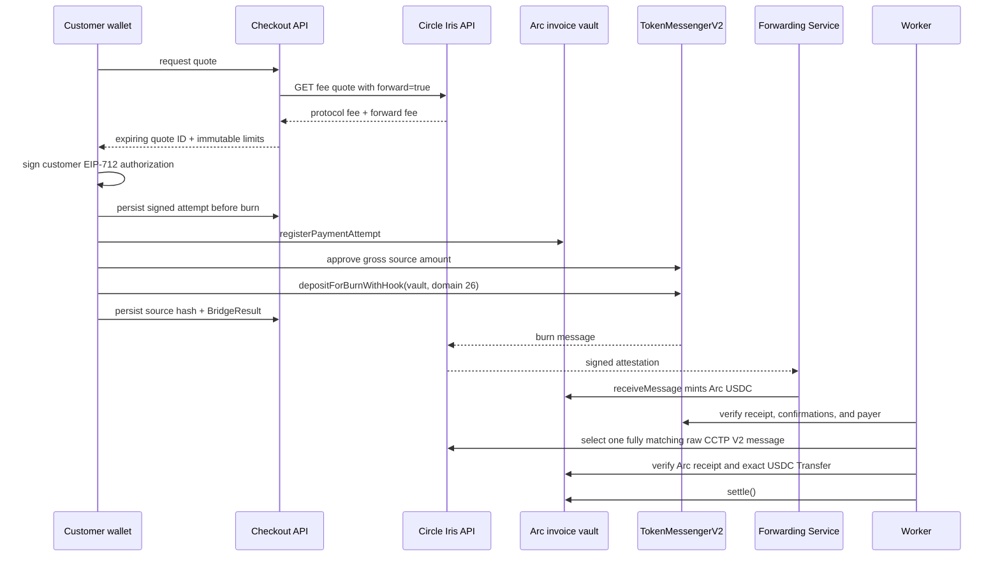

# CCTP V2 flow

The source burn amount is grossed up so the requested invoice amount reaches the vault. The server-issued quote uses the current `minimumFee` and median `forwardFee`, adds a bounded safety buffer, expires after at most five minutes (and before the invoice safety margin), and can be claimed only once. The client cannot invent its amount, fee, finality, route, or expiry. Any destination excess is deterministically returned to the customer-locked Arc refund address.

The browser disables App Kit transaction batching so the source transaction sender remains directly verifiable. It persists the full `BridgeResult`; recovery calls `retryBridge` on that same result only when its burn step is already successful. A normal payment call is blocked after any observed burn.

Official testnet domains: Ethereum 0, Base 6, Arc 26. TokenMessengerV2 is `0x8FE6B999Dc680CcFDD5Bf7EB0974218be2542DAA`; MessageTransmitterV2 is `0xE737e5cEBEEBa77EFE34D4aa090756590b1CE275`. Values were verified against official Circle and Arc documentation on 2026-07-20 and live in one validated package.

Forwarding hook data must exactly equal Circle's reserved `cctp-forward` bytes. `destinationCaller` must be unrestricted (the zero address), because Forwarding Service cannot relay a caller-restricted message. The `mintRecipient` is the invoice vault itself, so no wrapper is needed.

The worker parses the raw V2 message rather than trusting decoded API fields or `messages[0]`. It verifies both domains, TokenMessenger header identities, destination caller, native source USDC, vault, payer, burn amount, `maxFee`, requested/executed finality, executed fee, forwarding hook, message hash, event nonce, and attestation metadata. `ARC_MINTED` additionally requires a successful forwarding receipt with exactly one expected Arc USDC transfer to the vault.

Direct mint is documented as a troubleshooting alternative, but the customer-facing path uses Forwarding Service.
