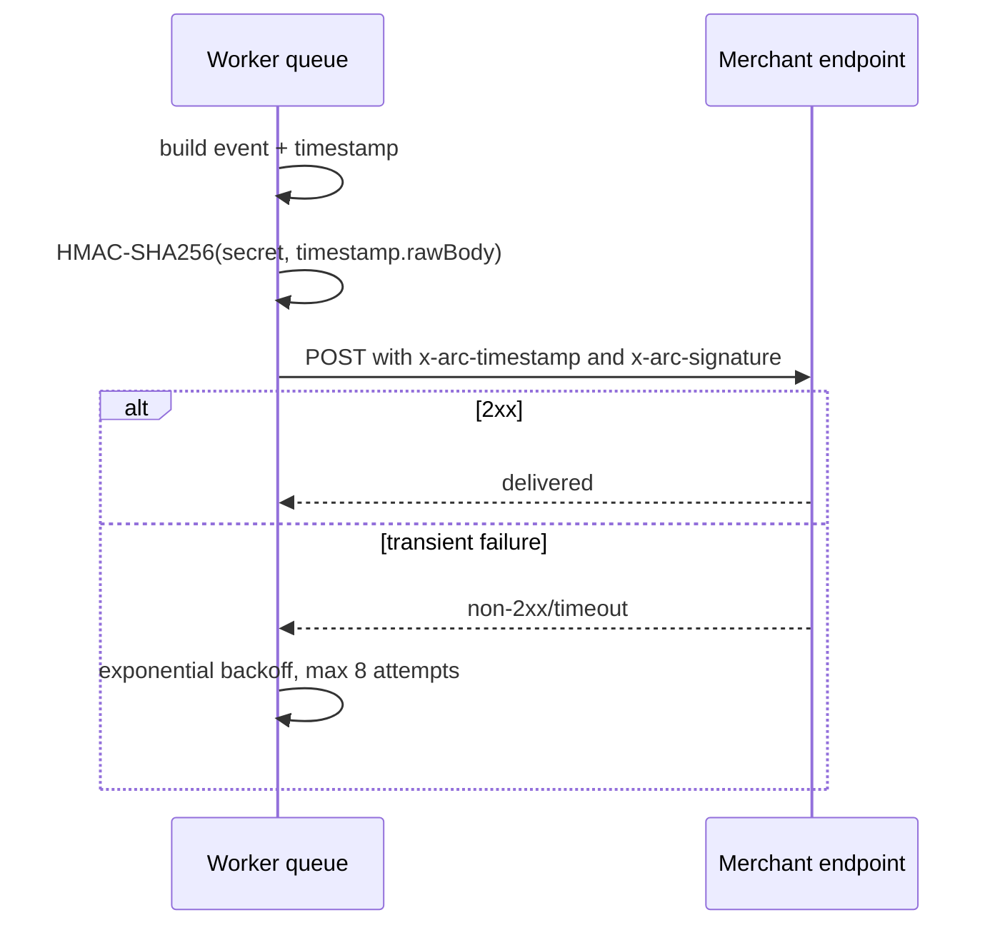

# Webhooks

Events: `payment.intent.created`, `payment.source_confirmed`, `payment.arc_minted`, `payment.settled`, `payment.expired`, and `payment.refunded`.

Verification must use the raw request body, reject timestamps older than five minutes, parse the `v1=` signature, calculate HMAC-SHA256 over `timestamp.rawBody`, and compare in constant time. Use `verifyWebhookSignature` from `@arc-checkout/sdk`.

Secrets are displayed once and stored encrypted with AES-256-GCM. Production endpoints require HTTPS. Registration and delivery reject private/reserved destinations and can enforce `ALLOWED_WEBHOOK_HOSTS`.
