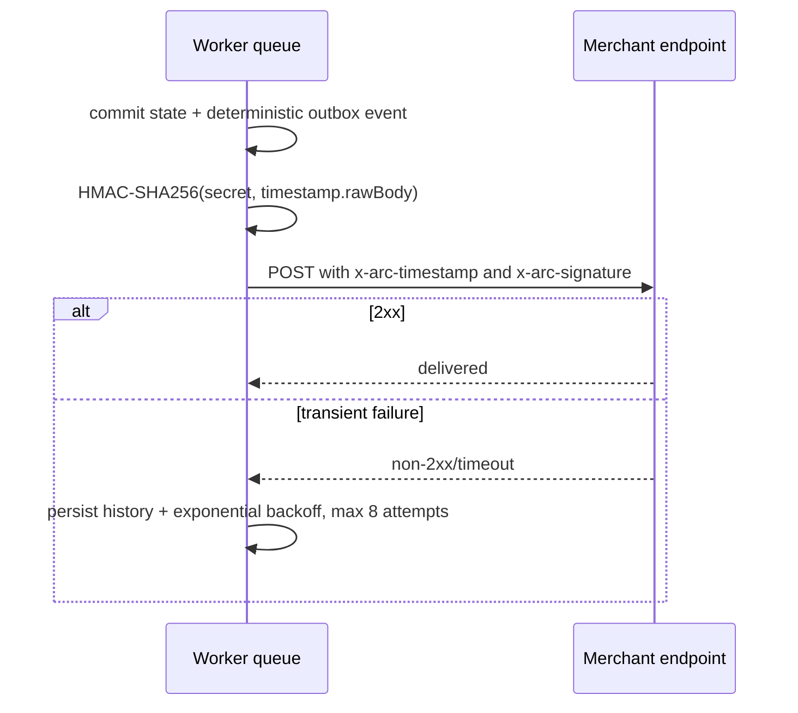

# Webhooks

Supported events:

- `payment.intent.created`
- `payment.attempt.created`
- `payment.source_submitted`
- `payment.source_confirmed`
- `payment.attestation_received`
- `payment.arc_minted`
- `payment.settled`
- `payment.cancelled`
- `payment.expired`
- `payment.refunded`
- `payment.excess_swept`



Payment state and its outbox event commit in one PostgreSQL transaction. Event IDs are derived from immutable lifecycle identities; finalized Arc events use `type:chainId:transactionHash:logIndex`. Deliveries are ordered by event sequence for each invoice and endpoint. A permanently failed earlier delivery blocks later events for that invoice until the merchant replays it. Delivery attempts, response codes, and errors remain in history.

Every request includes `x-arc-event-id`; consumers must store that value and ignore an ID already processed. A manual replay or resend intentionally reuses the same event ID, so a receiver can safely return success without applying the business action twice.

Verification must use the raw request body, reject timestamps older than five minutes, parse the `v1=` signature, calculate HMAC-SHA256 over `timestamp.rawBody`, and compare in constant time. Use `verifyWebhookSignature` from `@arc-checkout/sdk`:

```ts
import { verifyWebhookSignature } from "@arc-checkout/sdk";

const valid = verifyWebhookSignature({
  secret: process.env.ARC_WEBHOOK_SECRET!,
  timestamp: request.headers.get("x-arc-timestamp")!,
  rawBody,
  signature: request.headers.get("x-arc-signature")!,
});
if (!valid) return new Response("invalid signature", { status: 401 });
```

Authenticated merchants can inspect delivery history with `GET /api/webhooks`, replay a permanently failed delivery with `POST /api/webhooks/deliveries/:id/replay`, or resend an event to all currently active subscribed endpoints with `POST /api/webhooks/events/:id/resend`.

Secrets are displayed once and stored encrypted with AES-256-GCM. Production endpoints require HTTPS. Registration and delivery reject private/reserved destinations and can enforce `ALLOWED_WEBHOOK_HOSTS`.
